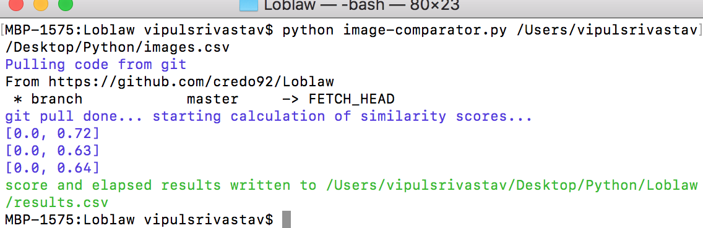

# Loblaw Take Home Assignment

## Pre-requisites / Install 
1. Python 3.6.5
2. pip 19.2.1
3. Download [git for Windows](https://git-scm.com/download/win) OR [git for MacOS](https://git-scm.com/download/mac) 

## Libraries Used
1. pandas to read/write CSV
2. opencv-python==4.1.0.25 to calculate similarity scores using SIFT metric
3. pytest for unit-testing
4. colorama to have colored logs in terminal (dependency for termcolor)
5. termcolor

## MacOS Instructions to install python / upgrade pip 
1.  From Terminal run `brew install python` to install python
2.  then run `curl https://bootstrap.pypa.io/get-pip.py -o get-pip.py`
3.  then `python get-pip.py`
2.  then `pip install -U pip`

## Windows Instructions to install python / upgrade pip  
1. Download [Python 3.6.5](https://www.python.org/downloads/release/python-365/)
2. Download [get-pip](https://bootstrap.pypa.io/get-pip.py) to a folder
2. Then go to the downloaded folder and run `python get-pip.py`
3. To upgrade run `python -m pip install -U pip`

## Folder Structure
1. dumps - to store test runs 
2. resources - have test pngs that are used for unit-tests
3. tests - unit tests defined for utility functions
4. utils - functions defined for calculating similarity, elapsed times and checking if csv contains valid file paths

## Steps to run project 
1. Download project or run `git clone https://github.com/credo92/Loblaw.git`
2. Then go to root folder and then run `pip install -r requirements.txt` to install required libraries
3. From root folder then run `python image-comparator.py <FILEPATH>` to get results, 
4. `<FILEPATH>` - a csv file on the system that contains  file paths for images that need to be compared
5. Go to folder/Results.csv to see similarity scores and elapsed times 

## Steps to run Project Unit Tests 
1. Run `pytest` from root folder to see tests

## Steps taken for designing and implementing the solution
1. Evaluated options - JavaScript , python then decided on python 
2. Ease of reading/writing csv using pandas, image-processing using opencv
3. Calculating runtime of a function call using time module
4. Researched Best metrics to evaluate Similarity between images by reading [research papers](https://www.cs.ubc.ca/~lowe/papers/ijcv04.pdf), 
   [springer](https://link.springer.com/chapter/10.1007%2F978-3-662-45498-5_1)
   narrowed it down to SIFT Score
   
## How do you know if your code works?
1. By Adding unit-tests for functions being used
2. By adding assertions in unit-tests using test data
3. Manually testing, giving wrong file paths in csv

## How are you going to teach Bjorn how to use the program?
1. By making sure README has all the required steps
2. Assisting the user in setting up the terminal utility, installing python and required dependencies
3. In order to make sure user gets right requirements, use `pip install -r requirements.txt` to install correct libraries
4. Demoing the utility , the first time so that user becomes familiar in using the utility

## Your manager Jeanie is assigning you to a different task and is making Ferris the maintainer of your application. How do you make sure he succeeds?
1. By Making sure the code is readable, testable basically by adding unit-tests and using proper naming/file/variable/function
   naming conventions
2. I am using [PEP8 Style Conventions](https://www.python.org/dev/peps/pep-0008/) to make sure code can be understood easily
3. Using a document generator like Epytext as given in this [stackoverflow question](https://stackoverflow.com/questions/3898572/what-is-the-standard-python-docstring-format)

## How are you ensuring Bjorn gets the latest version of your application?
1. I have created a subprocess, that basically runs `Popen(["git", "pull", "origin", "master"], stdout=PIPE)` 
2. Everytime the program is run, the process pulls the code from master and then proceeds with the program

## Broke down requirements into separate steps
1. Parse CSV, store its details in a dataframe
2. To make sure CSV filepaths are correct, send dataframe to a function `is_csv_good` that returns a boolean `True or False`
3. If its `False` in function `is_csv_good`, it labels the incorrect file paths
4. Then in the calling function `init` we dump a csv file `-test<TIMESTAMP>.csv` in `dumps/` folder so user can fix file paths
5. If csv is good, call `start_calculating_score_elapsed()`
6. In `start_calculating_score_elapsed()`  Call `function get_score_elapsed_info_lists()` to get  SIFT and elapsed scores lists
7. From `start_calculating_score_elapsed()` return a dataframe with all info
8. Convert dataframe to csv using pandas and write to location- current directory\results.csv `getcwd()+'/results.csv'`

  
  
  

  

